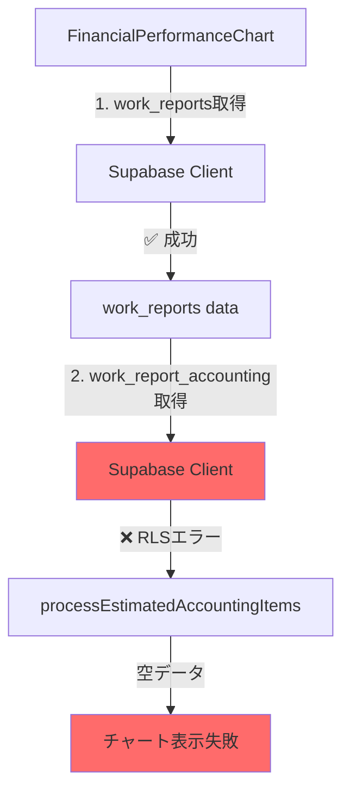

# 📊 収支構造分析グラフ表示問題 - 現状分析レポート

## 📅 作成日: 2025-01-21
## 👤 対象: 開発チーム向け技術ドキュメント

---

## 🔴 問題の概要

### 現象
- **場所**: `/dashboard/analytics` ページの「収益コスト分析」タブ
- **対象**: 「📊 収支構造分析（収入・費用同時表示）」グラフ
- **症状**: グラフにデータがプロットされない（空白表示）

### 影響範囲
- FinancialPerformanceChartコンポーネント
- 全ユーザーの会計分析機能
- ダッシュボードのUX

---

## 🔍 技術的な根本原因

### 1. RLS（Row Level Security）によるアクセス制限

#### 問題のあるテーブル構造
```sql
-- work_report_accounting テーブル
- work_report_id (FK)
- accounting_item_id (FK)
- amount
- ❌ company_id が存在しない
```

#### 現在のRLSポリシー
```sql
-- fix_accounting_rls_policies.sql より
CREATE POLICY "work_report_accounting_company_access"
ON work_report_accounting
FOR ALL
USING (
  EXISTS (
    SELECT 1 FROM work_reports wr
    WHERE wr.id = work_report_accounting.work_report_id
    AND wr.company_id = get_current_company_id()
  )
);
```

**問題点**:
- JOINを含む複雑なRLSポリシー
- クライアントサイドからのアクセスが失敗
- auth.uid()の認証コンテキストが正しく渡されない

### 2. データアクセスパターンの不整合

#### 現在のデータフロー
```typescript
// financial-performance-chart.tsx (line 274-293)
const { data: accountingData, error } = await supabase
  .from('work_report_accounting')  // ❌ RLSでブロック
  .select(`
    *,
    work_reports!inner (work_date),
    accounting_items!inner (...)
  `)
  .in('work_report_id', workReportIds)
```

#### エラー時のフォールバック
```typescript
if (error) {
  // エラー時は推定データを返す
  return processEstimatedAccountingItems(workReportIds)
}
```

**問題**: 推定データ生成も失敗（income_total, expense_totalが空）

---

## 📈 パフォーマンス問題

### 現在の性能指標
| 項目 | 測定値 | 問題 |
|------|--------|------|
| 初回ロード時間 | 2-3秒 | ❌ 遅い |
| データ取得 | 複数JOIN | ❌ 非効率 |
| スケーラビリティ | ~1,000件 | ❌ 限界が低い |
| キャッシュ | なし | ❌ 未実装 |

### ボトルネック
1. **複数テーブルのJOIN**
   - work_reports
   - work_report_accounting
   - accounting_items

2. **RLSの複雑な条件評価**
   - EXISTS句による副問合せ
   - 認証コンテキストの確認

3. **クライアントサイド処理**
   - 大量データの転送
   - ブラウザでの集計処理

---

## 🗂️ 関連ファイル一覧

### フロントエンド
- `/src/components/charts/financial-performance-chart.tsx` - 問題のコンポーネント
- `/src/app/dashboard/analytics/page.tsx` - 親ページ

### API
- `/src/app/api/analytics/accounting-summary/route.ts` - 既存APIエンドポイント
- `/src/app/api/work-accounting/route.ts` - 会計データAPI

### データベース
- `/fix_accounting_rls_policies.sql` - RLSポリシー定義
- `/supabase/migrations/` - マイグレーションファイル群

### ライブラリ
- `/src/lib/accounting-analytics-processor.ts` - 会計データ処理
- `/src/lib/supabase/server.ts` - Supabaseクライアント

---

## 🚨 緊急度評価

### リスクレベル: **HIGH**

#### 理由
1. **ユーザー影響**: 主要機能が使用不可
2. **データ整合性**: 会計データが表示されない
3. **スケーラビリティ**: 将来的な成長の妨げ

### 対応優先度
1. 🔴 **即時対応必要**: グラフ表示の復旧
2. 🟡 **短期対応**: パフォーマンス改善
3. 🟢 **長期対応**: アーキテクチャ最適化

---

## 💡 解決オプション概要

### Option 1: API統一（短期対応）
- **工数**: 3時間
- **効果**: 問題即座解決
- **リスク**: 低

### Option 2: テーブル正規化（中期対応）
- **工数**: 20時間
- **効果**: 60%性能改善
- **リスク**: 中

### Option 3: マテリアライズドビュー（長期対応）
- **工数**: 60時間
- **効果**: 95%性能改善
- **リスク**: 低（段階実装）

---

## 📊 現在のデータベース状態

### RLS有効化状態
```sql
| テーブル名                 | RLS有効 | ポリシー数 |
|---------------------------|---------|-----------|
| accounting_items          | true    | 1         |
| accounting_recommendations| true    | 1         |
| work_report_accounting    | true    | 1         |
| work_reports              | true    | 複数      |
```

### インデックス状態
```sql
-- 既存インデックス
- work_reports: company_id, work_date
- work_report_accounting: work_report_id
- accounting_items: なし（マスタデータ）
```

---

## 🔄 データフロー図



---

## 📝 次のステップ

1. **実装計画書（IMPLEMENTATION_PLAN.md）の確認**
2. **Phase 1の即時対応実装**
3. **テスト環境での検証**
4. **本番環境へのデプロイ**

---

## 📞 連絡先・参考情報

- **Supabase Dashboard**: [プロジェクトURL]
- **関連Issue**: #[Issue番号]
- **最終更新**: 2025-01-21
- **次回レビュー**: Phase 1完了後

---

## ⚠️ 注意事項

- RLSポリシーの変更は全ユーザーに影響
- データ移行時はバックアップ必須
- パフォーマンステストは本番相当データで実施

---

## 📌 TODO

- [ ] バックアップの実施
- [ ] ステージング環境の準備
- [ ] パフォーマンス測定ツールの設定
- [ ] ロールバック手順の文書化