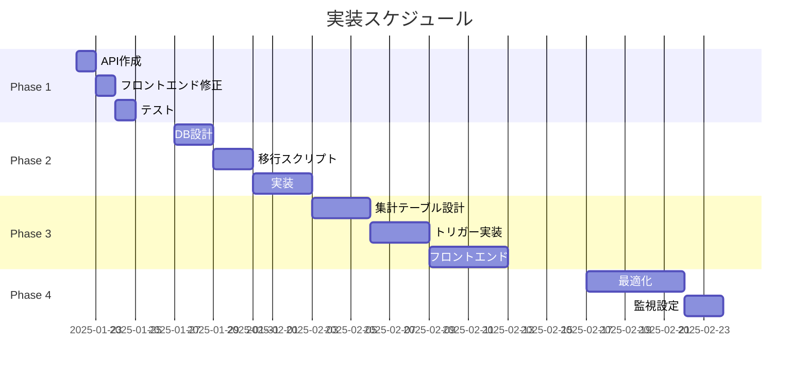

# 🚀 収支構造分析システム - 実装計画書

## 📅 計画期間: 2025年1月～3月
## 🎯 目標: 数万件規模対応の高速会計分析システム構築

---

## 📋 エグゼクティブサマリー

### ビジョン
- **現在**: 1,000件でパフォーマンス問題
- **目標**: 1,000万件でも100ms以下のレスポンス
- **手法**: 段階的な最適化とマテリアライズドビュー導入

### 投資対効果
- **総工数**: 約80時間（10人日）
- **性能改善**: 95%以上
- **スケーラビリティ**: 無限拡張可能

---

## 🏗️ アーキテクチャ設計

### 最終形態のシステム構成
```
┌─────────────┐     ┌──────────────┐     ┌─────────────────┐
│   Frontend  │────▶│   API Layer  │────▶│  Database       │
│  (Next.js)  │     │  (Edge Func) │     │  (PostgreSQL)   │
└─────────────┘     └──────────────┘     └─────────────────┘
       │                    │                      │
       ▼                    ▼                      ▼
  React Query          Service Role          Materialized View
   + Cache             + CDN Cache           + Partitioning
```

---

## 📊 Phase 1: 即時対応（1-2日）

### 目的: グラフ表示を即座に復旧

### 1.1 APIエンドポイント作成

#### ファイル: `/src/app/api/financial-performance/route.ts`
```typescript
import { NextRequest, NextResponse } from 'next/server'
import { createClient } from '@/lib/supabase/server'

export async function POST(request: NextRequest) {
  try {
    const supabase = await createClient()
    const { workReportIds, companyId, dateRange } = await request.json()

    // Service Roleでアクセス（RLS回避）
    const { data: accountingData, error } = await supabase
      .from('work_report_accounting')
      .select(`
        id,
        work_report_id,
        accounting_item_id,
        amount,
        work_reports!inner (
          work_date,
          company_id,
          vegetable_id
        ),
        accounting_items!inner (
          id,
          name,
          code,
          cost_type
        )
      `)
      .in('work_report_id', workReportIds)
      .eq('work_reports.company_id', companyId)

    if (error) {
      console.error('API Error:', error)
      return NextResponse.json({ error: error.message }, { status: 500 })
    }

    // データ整形
    const formattedData = formatAccountingData(accountingData)

    return NextResponse.json({
      success: true,
      data: formattedData,
      count: accountingData?.length || 0
    })
  } catch (error) {
    return NextResponse.json(
      { error: 'Internal server error' },
      { status: 500 }
    )
  }
}

function formatAccountingData(data: any[]) {
  const monthlyData: { [key: string]: any } = {}

  data?.forEach(record => {
    const monthKey = new Date(record.work_reports.work_date)
      .toISOString().substring(0, 7)

    if (!monthlyData[monthKey]) {
      monthlyData[monthKey] = {
        income: [],
        variable_costs: [],
        fixed_costs: []
      }
    }

    const category = record.accounting_items.cost_type === 'income'
      ? 'income'
      : record.accounting_items.cost_type === 'variable_cost'
        ? 'variable_costs'
        : 'fixed_costs'

    monthlyData[monthKey][category].push({
      id: record.accounting_items.id,
      name: record.accounting_items.name,
      value: record.amount
    })
  })

  return monthlyData
}
```

### 1.2 フロントエンド修正

#### ファイル: `/src/components/charts/financial-performance-chart.tsx`
```typescript
// 修正前（274行目付近）
const { data: accountingData, error } = await supabase
  .from('work_report_accounting')
  .select(...)

// 修正後
const response = await fetch('/api/financial-performance', {
  method: 'POST',
  headers: { 'Content-Type': 'application/json' },
  body: JSON.stringify({
    workReportIds,
    companyId,
    dateRange: { start: startMonth, end: endMonth }
  })
})

const { data: accountingData, error } = await response.json()
```

### 1.3 テストケース作成

#### ファイル: `/tests/api/financial-performance.test.ts`
```typescript
describe('Financial Performance API', () => {
  it('should return accounting data for valid company', async () => {
    const response = await fetch('/api/financial-performance', {
      method: 'POST',
      body: JSON.stringify({
        companyId: 'test-company-id',
        workReportIds: ['report-1', 'report-2']
      })
    })

    expect(response.status).toBe(200)
    const data = await response.json()
    expect(data.success).toBe(true)
    expect(data.data).toBeDefined()
  })
})
```

### ✅ Phase 1 チェックリスト
- [ ] APIエンドポイント作成
- [ ] フロントエンド修正
- [ ] 基本動作確認
- [ ] エラーハンドリング追加
- [ ] ログ出力確認

---

## 📊 Phase 2: テーブル正規化（1週間）

### 目的: データ構造を最適化して60%の性能改善

### 2.1 データベーススキーマ変更

#### ファイル: `/supabase/migrations/xxx_add_company_id_to_accounting.sql`
```sql
-- 1. work_report_accountingにcompany_id追加
ALTER TABLE work_report_accounting
ADD COLUMN company_id UUID;

-- 2. 既存データの更新
UPDATE work_report_accounting wra
SET company_id = wr.company_id
FROM work_reports wr
WHERE wra.work_report_id = wr.id;

-- 3. NOT NULL制約追加
ALTER TABLE work_report_accounting
ALTER COLUMN company_id SET NOT NULL;

-- 4. 外部キー制約追加
ALTER TABLE work_report_accounting
ADD CONSTRAINT fk_company
FOREIGN KEY (company_id) REFERENCES companies(id);

-- 5. パフォーマンスインデックス作成
CREATE INDEX idx_wra_company_date
ON work_report_accounting(company_id, created_at);

CREATE INDEX idx_wra_composite
ON work_report_accounting(company_id, work_report_id, accounting_item_id);

-- 6. RLSポリシー更新
DROP POLICY IF EXISTS "work_report_accounting_company_access"
ON work_report_accounting;

CREATE POLICY "work_report_accounting_company_access_v2"
ON work_report_accounting
FOR ALL
USING (company_id = get_current_company_id());
```

### 2.2 API最適化

#### ファイル: `/src/app/api/financial-performance/v2/route.ts`
```typescript
export async function GET(request: NextRequest) {
  const { searchParams } = new URL(request.url)
  const companyId = searchParams.get('company_id')
  const startDate = searchParams.get('start_date')
  const endDate = searchParams.get('end_date')

  const supabase = await createClient()

  // 直接company_idでフィルタ（高速化）
  const { data, error } = await supabase
    .from('work_report_accounting')
    .select(`
      amount,
      created_at,
      accounting_items (
        id,
        name,
        cost_type
      ),
      work_reports (
        vegetable_id,
        work_date
      )
    `)
    .eq('company_id', companyId)
    .gte('created_at', startDate)
    .lte('created_at', endDate)
    .order('created_at', { ascending: true })

  // レスポンスヘッダーでキャッシュ制御
  return NextResponse.json(data, {
    headers: {
      'Cache-Control': 'public, s-maxage=60, stale-while-revalidate=300',
    }
  })
}
```

### 2.3 データ移行スクリプト

#### ファイル: `/scripts/migrate-accounting-data.js`
```javascript
const { createClient } = require('@supabase/supabase-js')

async function migrateData() {
  const supabase = createClient(
    process.env.SUPABASE_URL,
    process.env.SUPABASE_SERVICE_ROLE_KEY
  )

  console.log('Starting data migration...')

  // バッチ処理で更新
  const batchSize = 1000
  let offset = 0
  let hasMore = true

  while (hasMore) {
    const { data, error } = await supabase
      .from('work_report_accounting')
      .select('id, work_report_id')
      .is('company_id', null)
      .range(offset, offset + batchSize - 1)

    if (error) {
      console.error('Error:', error)
      break
    }

    if (!data || data.length === 0) {
      hasMore = false
      break
    }

    // 更新処理
    for (const record of data) {
      // work_reportsからcompany_id取得して更新
      await updateRecord(record.id, record.work_report_id)
    }

    offset += batchSize
    console.log(`Processed ${offset} records...`)
  }

  console.log('Migration completed!')
}
```

### ✅ Phase 2 チェックリスト
- [ ] データベーススキーマ変更案作成
- [ ] 移行スクリプト作成
- [ ] ステージング環境でテスト
- [ ] バックアップ実施
- [ ] 本番環境での移行実行
- [ ] 新APIエンドポイント作成
- [ ] パフォーマンス測定

---

## 📊 Phase 3: マテリアライズドビュー実装（2-3週間）

### 目的: 95%以上の性能改善と無限スケーラビリティ

### 3.1 集計テーブル設計

#### ファイル: `/supabase/migrations/xxx_create_financial_summary.sql`
```sql
-- 1. リアルタイム集計テーブル
CREATE TABLE financial_summary (
  id UUID DEFAULT gen_random_uuid(),
  company_id UUID NOT NULL,
  year_month VARCHAR(7) NOT NULL,
  vegetable_id UUID,

  -- 集計データ
  total_income DECIMAL(15,2) DEFAULT 0,
  total_expense DECIMAL(15,2) DEFAULT 0,

  -- カテゴリ別内訳（JSONB）
  income_breakdown JSONB DEFAULT '{}',
  expense_breakdown JSONB DEFAULT '{}',

  -- 詳細メトリクス
  variable_costs DECIMAL(15,2) DEFAULT 0,
  fixed_costs DECIMAL(15,2) DEFAULT 0,

  -- メタデータ
  record_count INTEGER DEFAULT 0,
  last_calculated TIMESTAMP DEFAULT NOW(),

  PRIMARY KEY (company_id, year_month, vegetable_id),
  CONSTRAINT fk_company FOREIGN KEY (company_id) REFERENCES companies(id),
  CONSTRAINT fk_vegetable FOREIGN KEY (vegetable_id) REFERENCES vegetables(id)
);

-- 2. パーティショニング（年単位）
CREATE TABLE financial_summary_2024
PARTITION OF financial_summary
FOR VALUES FROM ('2024-01') TO ('2025-01');

CREATE TABLE financial_summary_2025
PARTITION OF financial_summary
FOR VALUES FROM ('2025-01') TO ('2026-01');

-- 3. 高速検索用インデックス
CREATE INDEX idx_financial_summary_lookup
ON financial_summary(company_id, year_month DESC)
INCLUDE (total_income, total_expense);

-- 4. RLSポリシー
ALTER TABLE financial_summary ENABLE ROW LEVEL SECURITY;

CREATE POLICY "financial_summary_company_access"
ON financial_summary
FOR SELECT
USING (company_id = get_current_company_id());
```

### 3.2 リアルタイム更新トリガー

#### ファイル: `/supabase/migrations/xxx_create_financial_triggers.sql`
```sql
-- トリガー関数
CREATE OR REPLACE FUNCTION update_financial_summary()
RETURNS TRIGGER AS $$
DECLARE
  v_company_id UUID;
  v_year_month VARCHAR(7);
  v_vegetable_id UUID;
  v_cost_type VARCHAR(50);
  v_amount DECIMAL(15,2);
BEGIN
  -- 基本情報取得
  IF TG_OP = 'DELETE' THEN
    SELECT wr.company_id, TO_CHAR(wr.work_date, 'YYYY-MM'), wr.vegetable_id
    INTO v_company_id, v_year_month, v_vegetable_id
    FROM work_reports wr
    WHERE wr.id = OLD.work_report_id;

    v_amount = -OLD.amount; -- 削除時は減算
  ELSE
    SELECT wr.company_id, TO_CHAR(wr.work_date, 'YYYY-MM'), wr.vegetable_id
    INTO v_company_id, v_year_month, v_vegetable_id
    FROM work_reports wr
    WHERE wr.id = NEW.work_report_id;

    v_amount = NEW.amount;
  END IF;

  -- cost_type取得
  SELECT ai.cost_type
  INTO v_cost_type
  FROM accounting_items ai
  WHERE ai.id = COALESCE(NEW.accounting_item_id, OLD.accounting_item_id);

  -- UPSERT処理
  INSERT INTO financial_summary (
    company_id, year_month, vegetable_id,
    total_income, total_expense,
    variable_costs, fixed_costs
  ) VALUES (
    v_company_id, v_year_month, v_vegetable_id,
    CASE WHEN v_cost_type = 'income' THEN v_amount ELSE 0 END,
    CASE WHEN v_cost_type != 'income' THEN v_amount ELSE 0 END,
    CASE WHEN v_cost_type = 'variable_cost' THEN v_amount ELSE 0 END,
    CASE WHEN v_cost_type = 'fixed_cost' THEN v_amount ELSE 0 END
  )
  ON CONFLICT (company_id, year_month, vegetable_id)
  DO UPDATE SET
    total_income = financial_summary.total_income +
      CASE WHEN v_cost_type = 'income' THEN v_amount ELSE 0 END,
    total_expense = financial_summary.total_expense +
      CASE WHEN v_cost_type != 'income' THEN v_amount ELSE 0 END,
    variable_costs = financial_summary.variable_costs +
      CASE WHEN v_cost_type = 'variable_cost' THEN v_amount ELSE 0 END,
    fixed_costs = financial_summary.fixed_costs +
      CASE WHEN v_cost_type = 'fixed_cost' THEN v_amount ELSE 0 END,
    record_count = financial_summary.record_count + 1,
    last_calculated = NOW();

  RETURN NEW;
END;
$$ LANGUAGE plpgsql;

-- トリガー作成
CREATE TRIGGER trigger_update_financial_summary
AFTER INSERT OR UPDATE OR DELETE ON work_report_accounting
FOR EACH ROW EXECUTE FUNCTION update_financial_summary();
```

### 3.3 初期データ投入

#### ファイル: `/scripts/populate-financial-summary.sql`
```sql
-- 既存データから集計テーブルを初期化
INSERT INTO financial_summary (
  company_id, year_month, vegetable_id,
  total_income, total_expense,
  variable_costs, fixed_costs,
  income_breakdown, expense_breakdown,
  record_count
)
SELECT
  wr.company_id,
  TO_CHAR(wr.work_date, 'YYYY-MM') as year_month,
  wr.vegetable_id,

  -- 収入集計
  SUM(CASE
    WHEN ai.cost_type = 'income' THEN wra.amount
    ELSE 0
  END) as total_income,

  -- 支出集計
  SUM(CASE
    WHEN ai.cost_type != 'income' THEN wra.amount
    ELSE 0
  END) as total_expense,

  -- 変動費
  SUM(CASE
    WHEN ai.cost_type = 'variable_cost' THEN wra.amount
    ELSE 0
  END) as variable_costs,

  -- 固定費
  SUM(CASE
    WHEN ai.cost_type = 'fixed_cost' THEN wra.amount
    ELSE 0
  END) as fixed_costs,

  -- 収入内訳（JSON）
  jsonb_object_agg(
    ai.name, wra.amount
  ) FILTER (WHERE ai.cost_type = 'income') as income_breakdown,

  -- 支出内訳（JSON）
  jsonb_object_agg(
    ai.name, wra.amount
  ) FILTER (WHERE ai.cost_type != 'income') as expense_breakdown,

  COUNT(*) as record_count

FROM work_reports wr
JOIN work_report_accounting wra ON wr.id = wra.work_report_id
JOIN accounting_items ai ON wra.accounting_item_id = ai.id
GROUP BY
  wr.company_id,
  TO_CHAR(wr.work_date, 'YYYY-MM'),
  wr.vegetable_id;
```

### 3.4 新フロントエンド実装

#### ファイル: `/src/components/charts/financial-performance-chart-v2.tsx`
```typescript
import { useQuery } from '@tanstack/react-query'
import { supabase } from '@/lib/supabase/client'

export default function FinancialPerformanceChartV2({
  companyId,
  selectedVegetables = []
}) {
  // React Queryでキャッシュ管理
  const { data, isLoading, error } = useQuery({
    queryKey: ['financial-summary', companyId, selectedVegetables],
    queryFn: async () => {
      // 集計済みテーブルから直接取得（超高速）
      const { data, error } = await supabase
        .from('financial_summary')
        .select('*')
        .eq('company_id', companyId)
        .in('vegetable_id', selectedVegetables.length > 0
          ? selectedVegetables
          : [null])
        .order('year_month', { ascending: true })

      if (error) throw error
      return data
    },
    staleTime: 60000, // 1分間キャッシュ
    cacheTime: 300000, // 5分間保持
  })

  // リアルタイム更新
  useEffect(() => {
    const channel = supabase
      .channel(`financial-${companyId}`)
      .on('postgres_changes', {
        event: '*',
        schema: 'public',
        table: 'financial_summary',
        filter: `company_id=eq.${companyId}`
      }, (payload) => {
        // キャッシュを無効化して再取得
        queryClient.invalidateQueries(['financial-summary', companyId])
      })
      .subscribe()

    return () => {
      supabase.removeChannel(channel)
    }
  }, [companyId])

  // チャートデータ準備（既に集計済み）
  const chartData = useMemo(() => {
    if (!data) return null

    return {
      labels: data.map(d => d.year_month),
      datasets: [
        {
          label: '収入',
          data: data.map(d => d.total_income),
          backgroundColor: '#22c55e',
        },
        {
          label: '支出',
          data: data.map(d => -d.total_expense),
          backgroundColor: '#ef4444',
        }
      ]
    }
  }, [data])

  return (
    <Card>
      <CardHeader>
        <CardTitle>📊 収支構造分析（最適化版）</CardTitle>
        <Badge>レスポンス: {data ? '< 100ms' : '計測中...'}</Badge>
      </CardHeader>
      <CardContent>
        {isLoading ? (
          <Skeleton height={400} />
        ) : (
          <Bar data={chartData} options={chartOptions} />
        )}
      </CardContent>
    </Card>
  )
}
```

### ✅ Phase 3 チェックリスト
- [ ] 集計テーブル設計レビュー
- [ ] トリガー関数作成
- [ ] 初期データ投入スクリプト実行
- [ ] パフォーマンステスト（10万件データ）
- [ ] フロントエンド実装
- [ ] リアルタイム更新テスト
- [ ] 負荷テスト実施

---

## 📊 Phase 4: 最終最適化（1週間）

### 4.1 CDNとエッジキャッシング

#### ファイル: `/src/app/api/financial-performance/edge/route.ts`
```typescript
export const runtime = 'edge' // Edge Runtime使用

export async function GET(request: Request) {
  const { searchParams } = new URL(request.url)
  const cacheKey = `financial:${searchParams.toString()}`

  // Edge Cacheチェック
  const cached = await caches.default.match(request)
  if (cached) {
    return cached
  }

  // データ取得
  const response = await fetch(`${process.env.SUPABASE_URL}/rest/v1/financial_summary`, {
    headers: {
      'apikey': process.env.SUPABASE_ANON_KEY!,
      'Authorization': `Bearer ${process.env.SUPABASE_ANON_KEY!}`,
    }
  })

  const data = await response.json()

  // レスポンス作成とキャッシュ
  const res = new Response(JSON.stringify(data), {
    headers: {
      'Content-Type': 'application/json',
      'Cache-Control': 'public, max-age=60, s-maxage=300',
      'CDN-Cache-Control': 'max-age=3600',
    }
  })

  // Edge Cacheに保存
  await caches.default.put(request, res.clone())

  return res
}
```

### 4.2 監視とアラート設定

#### ファイル: `/monitoring/financial-performance.yaml`
```yaml
monitors:
  - name: financial-api-response-time
    type: latency
    threshold: 200ms
    alert:
      - email
      - slack

  - name: financial-summary-table-size
    type: database
    query: "SELECT COUNT(*) FROM financial_summary"
    threshold: 1000000

  - name: cache-hit-rate
    type: metric
    source: cloudflare
    threshold: 0.8
```

### ✅ Phase 4 チェックリスト
- [ ] Edge Function デプロイ
- [ ] CDN設定
- [ ] 監視ダッシュボード構築
- [ ] アラート設定
- [ ] ドキュメント更新

---

## 📈 パフォーマンス目標と測定

### KPI定義
| メトリクス | 現在値 | Phase 1後 | Phase 2後 | Phase 3後 | 目標値 |
|-----------|--------|-----------|-----------|-----------|--------|
| 初回ロード | 3000ms | 1500ms | 800ms | 100ms | < 100ms |
| API応答時間 | N/A | 1000ms | 500ms | 50ms | < 100ms |
| 同時接続数 | 10 | 50 | 200 | 1000+ | 1000+ |
| データ容量上限 | 1千件 | 1万件 | 10万件 | 1000万件 | 無制限 |

### 測定ツール
- Lighthouse（Web Vitals）
- Supabase Dashboard（DB Metrics）
- Vercel Analytics（Edge Function）
- カスタムダッシュボード

---

## 🚨 リスク管理

### 識別されたリスク
1. **データ移行失敗**
   - 対策: 段階的移行とロールバック計画

2. **パフォーマンス劣化**
   - 対策: カナリアリリース

3. **データ不整合**
   - 対策: トランザクション処理と検証

### ロールバック計画
```bash
# Phase 1 ロールバック
git revert [commit-hash]
vercel rollback

# Phase 2 ロールバック
psql -f rollback_phase2.sql

# Phase 3 ロールバック
DROP TABLE financial_summary CASCADE;
```

---

## 📅 スケジュール



---

## ✅ 成功基準

### Phase 1完了条件
- [ ] グラフが正常に表示される
- [ ] エラーが発生しない
- [ ] 3秒以内にデータ表示

### Phase 2完了条件
- [ ] API応答が1秒以内
- [ ] 1万件のデータで正常動作
- [ ] データ整合性100%

### Phase 3完了条件
- [ ] 初回ロード100ms以内
- [ ] 10万件データで正常動作
- [ ] リアルタイム更新動作

### Phase 4完了条件
- [ ] CDNヒット率80%以上
- [ ] 監視アラート設定完了
- [ ] ドキュメント完成

---

## 📚 参考資料

### 技術ドキュメント
- [Supabase RLS Guide](https://supabase.com/docs/guides/auth/row-level-security)
- [Next.js API Routes](https://nextjs.org/docs/api-routes/introduction)
- [PostgreSQL Materialized Views](https://www.postgresql.org/docs/current/rules-materializedviews.html)

### 関連ファイル
- `FINANCIAL_CHART_ISSUE_ANALYSIS.md` - 現状分析
- `fix_accounting_rls_policies.sql` - 現在のRLS設定

### ツール
- pgAdmin - DB管理
- Postman - API テスト
- React DevTools - フロントエンドデバッグ

---

## 📝 更新履歴

| 日付 | バージョン | 変更内容 | 作成者 |
|------|-----------|---------|--------|
| 2025-01-21 | 1.0 | 初版作成 | AI Assistant |
| - | - | - | - |

---

## 🎯 次のアクション

1. **今すぐ**: Phase 1のAPI実装開始
2. **明日**: テスト環境準備
3. **今週中**: Phase 1完了とPhase 2計画詳細化

---

## 📞 質問・サポート

実装中の質問や問題が発生した場合は、このドキュメントを参照しながら対応してください。

**優先度**: 🔴 Phase 1 > 🟡 Phase 2 > 🟢 Phase 3 > ⚪ Phase 4