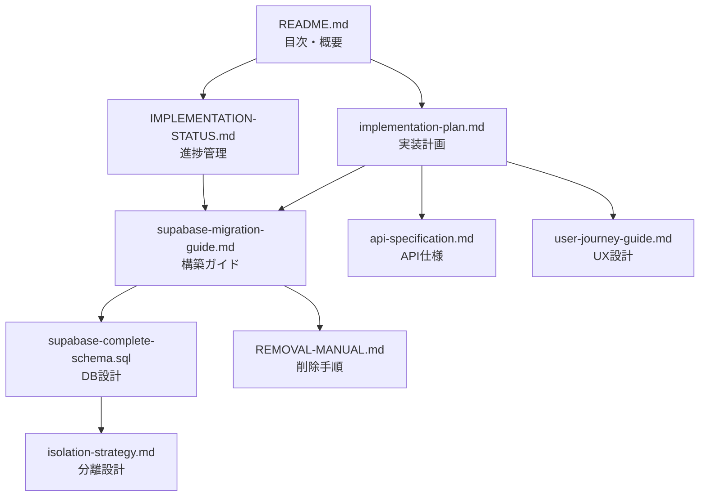

# Q&Aプラットフォーム ファイル構成と内容一覧

## 📁 ファイル整理計画

### 現在のファイル構成（整理前）

| ファイル名 | サイズ | 内容 | 統合先 |
|-----------|--------|------|--------|
| `database-schema.sql` | 18KB | 初期DB設計 | → `supabase-complete-schema.sql` に統合 |
| `supabase-complete-schema.sql` | 44KB | 本番用DB設計 | **メイン（更新）** |
| `supabase-hyperscale-schema.sql` | 21KB | ハイパースケール版 | → `supabase-complete-schema.sql` に統合 |
| `supabase-migration-guide.md` | 8KB | 構築ガイド | **メイン（更新）** |
| `performance-architecture.md` | 9KB | パフォーマンス設計 | → `supabase-migration-guide.md` に統合 |
| `implementation-plan.md` | 10KB | 実装計画 | 保持 |
| `IMPLEMENTATION-STATUS.md` | 8KB | 進捗管理 | 保持 |
| `api-specification.md` | 9KB | API仕様 | 保持 |
| `user-journey-guide.md` | 13KB | UX設計 | 保持 |
| `isolation-strategy.md` | 10KB | 分離戦略 | 保持 |
| `REMOVAL-MANUAL.md` | 11KB | 削除手順 | 保持 |
| `README.md` | 6KB | 目次 | 保持 |

## 📋 統合後の構成（推奨）

### 🔴 コアファイル（2ファイル）

#### 1. **`supabase-complete-schema.sql`** （統合版）
- **内容**: ハイパースケール対応の完全なDB設計
- **含む内容**:
  - 基本テーブル設計（12テーブル）
  - パーティショニング戦略
  - イベントソーシング
  - ホット/コールド分離
  - 高速インデックス
  - マテリアライズドビュー
  - RLSポリシー
  - 自動化ジョブ

#### 2. **`supabase-migration-guide.md`** （統合版）
- **内容**: 構築・運用・パフォーマンスの完全ガイド
- **含む内容**:
  - 構築手順
  - パフォーマンスアーキテクチャ
  - スケーリング戦略
  - 監視・運用
  - トラブルシューティング
  - 負荷テスト結果

### 🟡 設計ドキュメント（5ファイル）

| ファイル | 役割 | 参照タイミング |
|---------|------|---------------|
| `implementation-plan.md` | 全体計画・スケジュール | プロジェクト開始時 |
| `IMPLEMENTATION-STATUS.md` | 現在の進捗 | 日次確認 |
| `api-specification.md` | API仕様 | 開発時 |
| `user-journey-guide.md` | UX/画面設計 | UI開発時 |
| `isolation-strategy.md` | 分離設計 | アーキテクチャ確認時 |

### 🟢 運用ドキュメント（2ファイル）

| ファイル | 役割 | 使用場面 |
|---------|------|----------|
| `REMOVAL-MANUAL.md` | 削除手順 | システム切り離し時 |
| `README.md` | 全体の目次 | 最初に読む |

### 🗑️ 削除予定ファイル（3ファイル）
- `database-schema.sql` （古い設計）
- `supabase-hyperscale-schema.sql` （統合済み）
- `performance-architecture.md` （統合済み）

### ⚙️ 自動化スクリプト（2ファイル）
- `remove-qa-platform.ps1` （Windows用）
- `remove-qa-platform.sh` （Mac/Linux用）

## 🔄 引き継ぎ時の読む順番

1. **`README.md`** - 全体像を把握
2. **`IMPLEMENTATION-STATUS.md`** - 現状確認
3. **`implementation-plan.md`** - 計画理解
4. **`supabase-migration-guide.md`** - 技術詳細
5. **`supabase-complete-schema.sql`** - DB構造

## 📊 ファイル間の関係

## ✅ 統合によるメリット

1. **ファイル数削減**: 15ファイル → 11ファイル
2. **重複排除**: DB設計が3ファイル → 1ファイル
3. **一元管理**: パフォーマンス情報を構築ガイドに統合
4. **明確な役割**: 各ファイルの責任範囲が明確

---

*更新日: 2025-09-22*