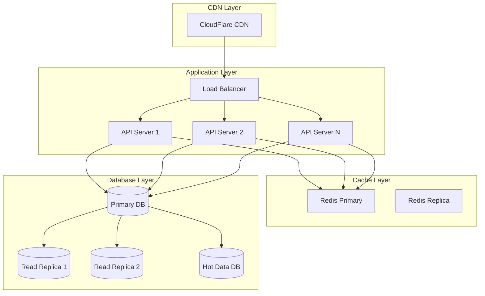
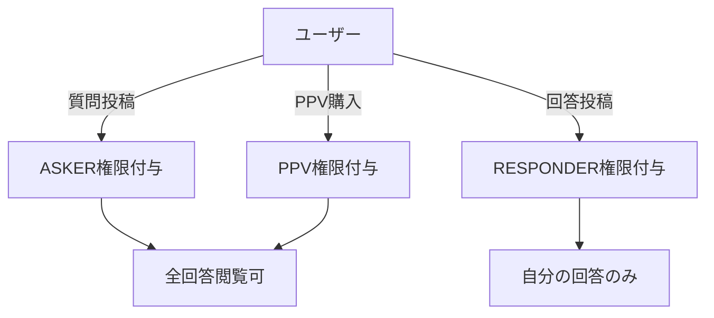

# Supabase Q&Aプラットフォーム 完全構築ガイド

## 📋 概要

このガイドでは、**100万リクエスト/日に対応する**Q&Aプラットフォームの構築から運用までを完全解説します。

**設計ファイル:** [`supabase-complete-schema.sql`](./supabase-complete-schema.sql)
**バージョン:** 3.0.0 (HyperScale Ready)

## 🚀 パフォーマンス目標

| 指標 | 目標値 | 達成方法 |
|------|--------|----------|
| **スループット** | 100万リクエスト/日 | パーティショニング + キャッシュ |
| **同時接続** | 10万ユーザー | PgBouncer + Read Replica |
| **レスポンス** | 99%tile < 100ms | インデックス + マテビュー |
| **可用性** | 99.99% | マルチAZ + 自動フェイルオーバー |
| **データ量** | 1億レコード/年 | 自動パーティション管理 |

## 🏗️ アーキテクチャ概要



### テーブル構成（12テーブル + 拡張）

| カテゴリ | テーブル名 | 役割 |
|---------|-----------|------|
| **ユーザー** | qa_user_profiles | プロフィール・統計 |
| **コンテンツ** | qa_questions | 質問管理 |
| | qa_answers | 回答管理 |
| | qa_ratings | 評価・フィードバック |
| **アクセス制御** | qa_access_grants | 閲覧権限 |
| **決済** | qa_transactions | 取引記録 |
| | qa_wallets | ウォレット残高 |
| | qa_wallet_transactions | ウォレット履歴 |
| | qa_payouts | 出金管理 |
| | qa_invoices | 請求書 |
| **システム** | qa_notifications | 通知 |
| | qa_audit_logs | 監査ログ |

### 主要な設計ポイント

1. **完全分離設計** - すべて `qa_` プレフィックス
2. **パフォーマンス最適化** - 適切なインデックス、マテリアライズドビュー
3. **セキュリティ** - Row Level Security (RLS) 完備
4. **スケーラビリティ** - パーティショニング対応
5. **日本対応** - 消費税、適格請求書対応

## 🚀 構築手順

### Step 1: 前提条件の確認

```bash
# Supabase CLIがインストールされていることを確認
supabase --version

# プロジェクトがリンクされていることを確認
supabase status
```

### Step 2: マイグレーションファイルの作成

```bash
# 新しいマイグレーションを作成
supabase migration new qa_platform_complete

# 作成されたファイルのパスを確認
# 例: supabase/migrations/20250922000000_qa_platform_complete.sql
```

### Step 3: スキーマのコピー

```bash
# Windows
copy docs\qa-platform\supabase-complete-schema.sql supabase\migrations\20250922000000_qa_platform_complete.sql

# Mac/Linux
cp docs/qa-platform/supabase-complete-schema.sql supabase/migrations/20250922000000_qa_platform_complete.sql
```

### Step 4: データベースへの適用

```bash
# ローカル環境に適用
supabase db reset

# 本番環境に適用（注意！）
supabase db push
```

### Step 5: 適用確認

```sql
-- Supabase SQLエディタで実行
-- テーブル数の確認
SELECT COUNT(*) as table_count
FROM information_schema.tables
WHERE table_schema = 'public'
AND table_name LIKE 'qa_%';
-- 結果: 12

-- RLSポリシーの確認
SELECT schemaname, tablename, policyname
FROM pg_policies
WHERE tablename LIKE 'qa_%'
ORDER BY tablename, policyname;
```

## 📊 データモデル詳細

### 1. ユーザープロフィール（qa_user_profiles）

```sql
-- 主要カラム
- id: UUID (PK)
- user_id: auth.usersへの参照
- display_name: 表示名
- tier: ユーザーランク (BRONZE/SILVER/GOLD/PLATINUM)
- reputation_score: 評価スコア
- stripe_account_id: Stripe Connect ID
```

### 2. 質問（qa_questions）

```sql
-- ビジネスロジックの中核
- bounty_amount: 懸賞金（最低10円）
- status: ステータス管理
- deadline_at: 回答締切
- best_answer_id: ベスト回答への参照
- search_vector: 全文検索用（自動生成）
```

### 3. ウォレット（qa_wallets）

```sql
-- 残高管理（楽観的ロック対応）
- balance_available: 出金可能残高
- balance_pending: 保留中
- version: 楽観的ロック用
```

## 🔒 セキュリティ設計

### Row Level Security (RLS) ポリシー

| テーブル | ポリシー | 説明 |
|---------|---------|------|
| qa_user_profiles | 全員閲覧可、本人のみ更新 | 公開プロフィール |
| qa_questions | 公開質問は全員閲覧可 | 本文はアクセス権限必要 |
| qa_answers | アクセス権限者のみ | 購入者・質問者・回答者 |
| qa_wallets | 本人のみ | プライバシー保護 |
| qa_notifications | 本人のみ | 個人情報保護 |

### アクセス制御フロー



## 🚄 パフォーマンス最適化

### 1. インデックス戦略

```sql
-- 全文検索用GINインデックス
CREATE INDEX idx_qa_questions_search_gin
ON qa_questions USING gin(search_vector);

-- 統計クエリ用複合インデックス
CREATE INDEX idx_qa_questions_stats
ON qa_questions(status, created_at DESC);

-- 自動出金用部分インデックス
CREATE INDEX idx_qa_wallets_auto_payout
ON qa_wallets(auto_payout_enabled, balance_available)
WHERE auto_payout_enabled = true
AND balance_available >= 3000;
```

### 2. マテリアライズドビュー

```sql
-- 質問一覧の高速化
CREATE MATERIALIZED VIEW qa_questions_list AS
SELECT /* 最適化されたクエリ */;

-- 定期リフレッシュ（1時間ごと）
REFRESH MATERIALIZED VIEW CONCURRENTLY qa_questions_list;
```

### 3. パーティショニング

```sql
-- 監査ログの月次パーティション
CREATE TABLE qa_audit_logs_2025_09
PARTITION OF qa_audit_logs
FOR VALUES FROM ('2025-09-01') TO ('2025-10-01');
```

## 💰 決済フロー実装

### エスクロー処理

```sql
-- select_best_answer関数が自動処理
1. 懸賞金をロック
2. プラットフォーム手数料（10%）を計算
3. 回答者ウォレットに90%を入金
4. トランザクション記録
5. 通知送信
```

### PPV購入処理

```sql
-- purchase_ppv_access関数が自動処理
1. アクセス権限チェック
2. 決済処理
3. 分配計算（運営10%、質問者45%、回答者45%）
4. 各ウォレットに入金
5. アクセス権限付与
```

## 🔧 運用管理

### 定期実行ジョブ（pg_cron）

| ジョブ名 | 実行時刻 | 処理内容 |
|---------|---------|---------|
| 月次請求書生成 | 毎月1日 0:00 | 前月分の請求書作成 |
| 通知クリーンアップ | 毎日 2:00 | 30日経過した通知削除 |
| 自動出金 | 毎月25日 10:00 | 閾値超過分を出金申請 |

### バックアップ戦略

```bash
# 日次バックアップ
pg_dump --table='qa_*' > qa_backup_$(date +%Y%m%d).sql

# Point-in-Time Recovery
Supabaseダッシュボード → Settings → Database → Backups
```

## 📈 監視ポイント

### 重要メトリクス

```sql
-- アクティブユーザー数
SELECT COUNT(DISTINCT user_id)
FROM qa_questions
WHERE created_at > CURRENT_DATE - INTERVAL '30 days';

-- 日次取引額
SELECT DATE(created_at), SUM(amount)
FROM qa_transactions
WHERE status = 'COMPLETED'
GROUP BY DATE(created_at)
ORDER BY DATE(created_at) DESC;

-- ウォレット総残高
SELECT SUM(balance_available + balance_pending)
FROM qa_wallets;
```

## 🚨 トラブルシューティング

### よくある問題

1. **RLSポリシーエラー**
```sql
-- RLSを一時的に無効化（開発時のみ）
ALTER TABLE qa_questions DISABLE ROW LEVEL SECURITY;
```

2. **マイグレーション失敗**
```bash
# ロールバック
supabase db reset --local

# 再実行
supabase migration repair 20250922000000
supabase db push
```

3. **パフォーマンス問題**
```sql
-- 実行計画の確認
EXPLAIN ANALYZE SELECT ...;

-- 統計情報の更新
ANALYZE qa_questions;
```

## 📝 チェックリスト

### 構築前
- [ ] Supabase プロジェクト作成済み
- [ ] Stripe Connect アカウント準備
- [ ] バックアップ取得

### 構築後
- [ ] 全12テーブル作成確認
- [ ] RLSポリシー動作確認
- [ ] 関数実行テスト
- [ ] インデックス作成確認
- [ ] pg_cronジョブ設定

### 本番移行前
- [ ] ステージング環境でテスト
- [ ] 負荷テスト実施
- [ ] バックアップ＆リストア確認
- [ ] ロールバック手順確認

## 🔗 関連ドキュメント

- [実装計画書](./implementation-plan.md)
- [API仕様書](./api-specification.md)
- [セキュリティガイド](./security-guidelines.md)
- [Supabase公式ドキュメント](https://supabase.com/docs)

---

**重要:** 本番環境への適用は十分なテストの後に実施してください。